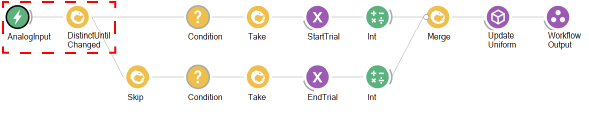
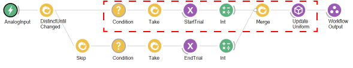
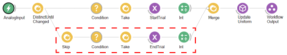
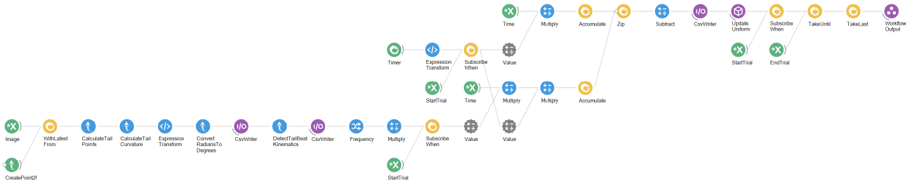
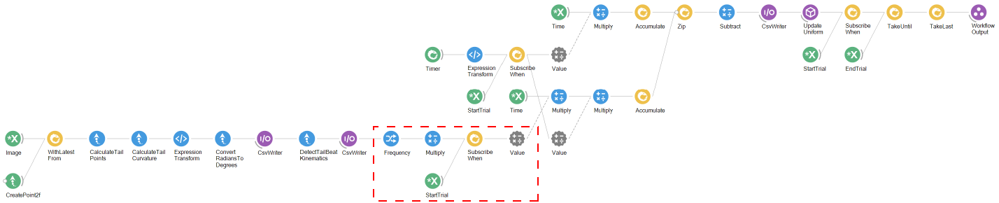
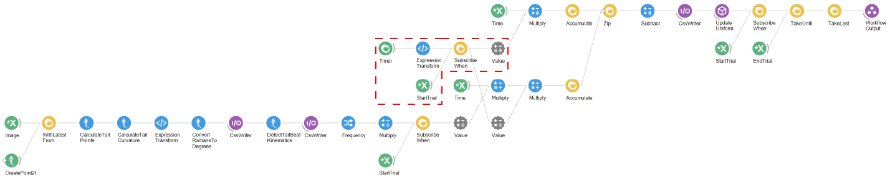

# BonZeb

# Calcium Imaging
BonZeb's methods can be used to implement simultaneous calcium imaging and closed-loop stimulation.

# Workflow
The calcium imaging workflow is shown below.

The structure of the workflow is similar to the workflow used in [1D closed-loop head-fixed](<../Closed-loop Head-fixed#1D-closed-loop-with-OMR>).
The generation of a `Time` variable, initialization of the shader, and the video acquisition are the same.
Below shows the encapsulated workflow contained in the group node `CheckArduino`.

An arduino is used to register signals from the microscope in Bonsai.
The `StandardFirmata` script, found in the Examples folder of the Arduino software, must be loaded onto the arduino.

A BNC cable is connected to the scan trigger of the microscope's general I/O box.
We connect the positive lead to the analog pin 1 on the arduino and connect the negative lead to the ground on the arduino.
The scan trigger sends high voltage signals when the microscope is actively scanning and low voltage signals otherwise.
We read the state of the pin using the `AnalogInput` node.
The `DistinctUntilChanged` node ensures that only a single output is produced if the incoming values are repeated.

A `Condition` node is set up to check if the signal from the analog input is greater than 0.
When the rising edge of the scan trigger is received by the arduino, this generates a value for the `StartTrial` subject and starts the trial.
The `StartTrial` node triggers an `Int` with a value of 1.
This value is then sent to the `switch_stim` variable in the shader through the `UpdateUniform` node to display the OMR stimulus.

Alternatively, when the scan trigger from the arduino equals 0, this triggers the `EndTrial` subject to generate a value.
At the end of the trial, an `Int` with a value of 0 is sent to turn the OMR stimulus off.

Inside the `ClosedLoop` node, we use a similar tracking method as the [1D closed-loop head-fixed](<../Closed-loop Head-fixed#1D-closed-loop-with-OMR>) workflow with some minor changes.

We use the `CreatePoint2f` node to generate a fixed point as the centroid of the animal.
We use the centroid to calculate the point along the tail, and then the tail angle.
We average the last three angles and convert the value into degrees.
After saving the data, we calculate the tail beat kinematics and save the data to a csv file.

We sample the `Frequency` property and multiply this value by the gain factor.
This value is then used to set the value of the `Multiply` node.
We only subscribe to the sequence once the trial has started.

At the same time, we use the `StartTrial` subject to initiate a `Timer`.
The `Timer` is set to fire every 15 seconds.
We use the `ExpressionTransform` node to check the output of the `Timer`.
When the `Timer` outputs a value of 1 or 2, following the 15 second and 30 second mark, respectively, the `ExpressionTransform` node generates a value of 1.
When the `Timer` produces any other value besides 1 or 2, the `ExpressionTransform` node outputs a 0.
This value is then used to start accumulating time.
When the trial starts, the OMR stimulus is displayed but remains static.
After 15 seconds, the OMR stimulus uses the accumulated time to update the phase of stimulus, generating perceived motion.

The output of the `ExpressionTransform` variable is used in 2 seperate pipelines, similar to the previous [1D closed-loop example](<../Closed-loop Head-fixed#1D-closed-loop-with-OMR>).
In the top stream, time is accumulated continuously, representing the base velocity of the stimulus.
In the bottom, time accumulates when the tail beat frequency increases, representing the closed-loop velocity.

These values are then zipped together and the closed-loop velocity is subtracted from the base velocity.
The resulting update to the stimulus phase is used to update the shader and the data are saved to a csv file.
After the `EndTrial` subject generates a value, the workflow terminates.

