# BonZeb

# Calibration
Calibration is essential to closed-loop and open-loop visual feedback.
There are multiple ways to calibrate a visual display in Bonsai. 
We provide a simple calibration method to map the area used for visual stimulus rendering to a camera’s FOV or a specified region within the camera’s FOV.
BonZeb provides the `DrawRectangle` node which is used to generate the values for the x and y offset, as well as the x and y range needed to update the vertex shader.
Multiple `DrawRectangle` nodes can be used to calibrate regions of interest (ROIs) within a larger field of view (FOV)

This folder contains the following sections:
1. [Full FOV](#full-fov)
2. [Calibrating sub regions within a FOV](#calibrating-sub-regions-within-a-fov)

# Full FOV
Below is the workflow used to calibrate a shader using the full FOV.

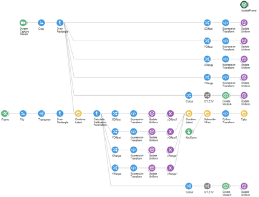

For calibration, we generate a simple white rectangle on a black background. 
We ensure that we can see the white rectangle in our camera’s FOV either by removing the IR filter or using a common reference point visible to us by eye and the camera (i.e. a translucent ruler). 
The goal for calibration is to match the edges of the presented rectangle to the edges of the camera’s FOV.
The `CameraCapture` node, or whichever camera node you are using to capture video, is used to visualize where the projected rectangle is positioned relative to the camera.

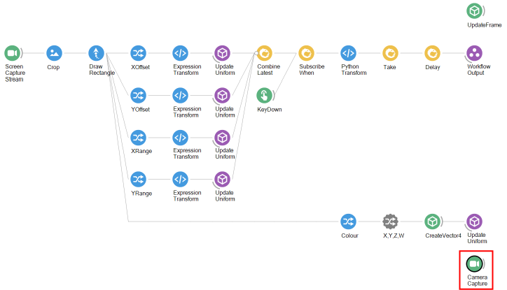

We use a `ScreenCaptureStream` node to retrieve what is being displayed across all of the desktop displays.
A `Crop` node is used to crop an ROI of the `ScreenCaptureNode` to just the display device we are interested in.
In our case, we have a 2k monitor on the left and a 1920 x 1080 projector on the right.
We set the ROI of the crop node to start at an x value of 2560 and set the width and height to 1920 and 1080, respectively.

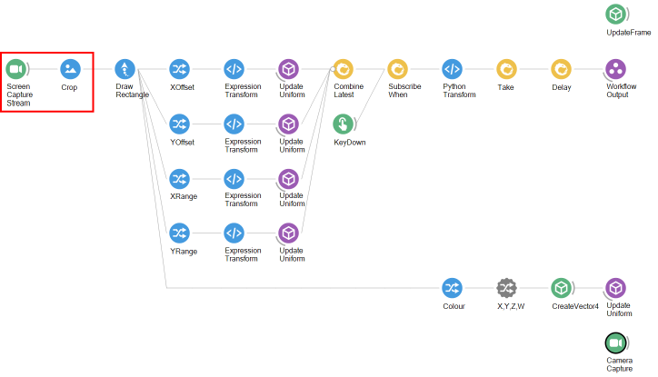

Similar to defining the ROI in the `Crop`, an ROI as drawn onto the incoming image with `DrawRectangle`.
The difference between the `Crop` and `DrawRectangle` modules is that the crop generates an image output whereas `DrawRectangle` produces a data type consisting of the calibration values.
The `DrawRectangle` node calculate the values for the x and y offset, as well as the x and y range needed for the shader.

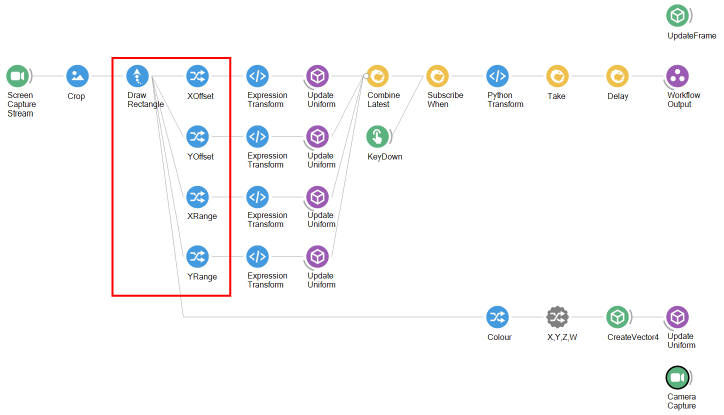

Each of these values is passed into a uniform variable which updates the position of the vertex shader.
The `DrawRectangle` node also generates a `Colour` attribute which can be used to change the colour of the rectangle used in the shader.

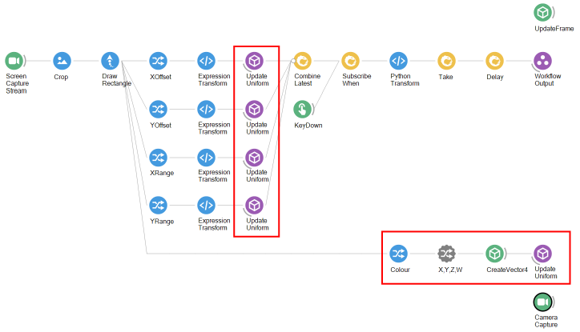

Once the edges of the projected rectangle are aligned to the edges of the camera, it is time to save the calibration parameters generated by the `DrawRectangle` node.
We do this by combining the variables back together and using the `SubscribeWhen` node triggered by a `KeyDown` to gate the inputs.
The `KeyDown` is set to fire when the `Tab` key on the keyboard is pressed.

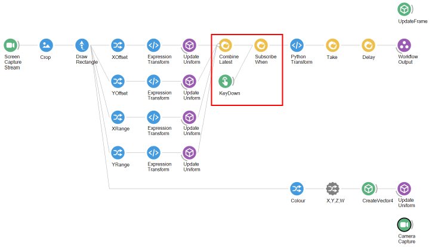

When the `Tab` key is pressed, the data are passed to a `PythonTransform` node.
The `PythonTransform` node allows us to use python in Bonsai workflows.
The contents of the `PythonTransform` node look like this.

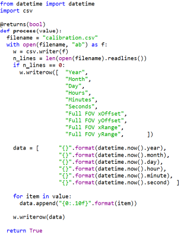

The `PythonTransform` takes the calibration and saves is to a `.csv` file with the current date and time.
After the `PythonTransform` node processes the data and saves it to file, a boolean value is passed to the downstream `Take` node.
The `Take` node takes 1 input.
Once the `Take` node receives input, the `Delay` node waits 1 second.
After the 1 second delay, the boolean reaches the `Workflow` output node and the Bonsai workflow terminates.

In summary, we use the `DrawRectangle` node in conjunction with the `ScreenCaptureStream` node to draw an ROI that is visible to the `CameraCapture` node.
Once the edges of the rectangle are aligned with the edges of the camera's FOV, we press the `Tab` key and save the calibration values to a csv file with the `PythonTransform` node.
1 second after saving the data to the csv file, the workflow terminates.

# Calibrating sub regions within the FOV
What if you want to render a stimulus to only a portion of the camera's FOV, or perhaps you would like to render stimuli to multiple sub regions?
We can do this using BonZeb and some tweaks to thhe original workflow above.
Below is the workflow used to calibrate a single ROI within the full FOV.

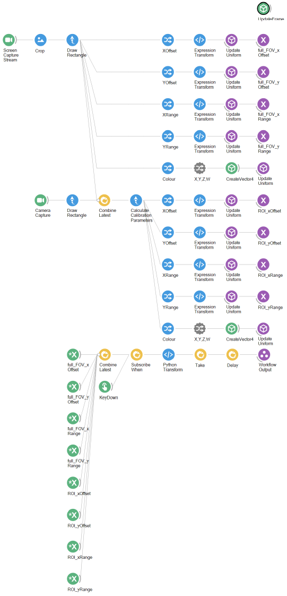

The workflow for calibrating a sub region within the camera's full FOV is similar to the workflow for calibrating the full FOV.
Calibrating a sub region uses the calibration parameters for the full FOV.
Thus, calculating the calibration values for the full FOV is the same as before.

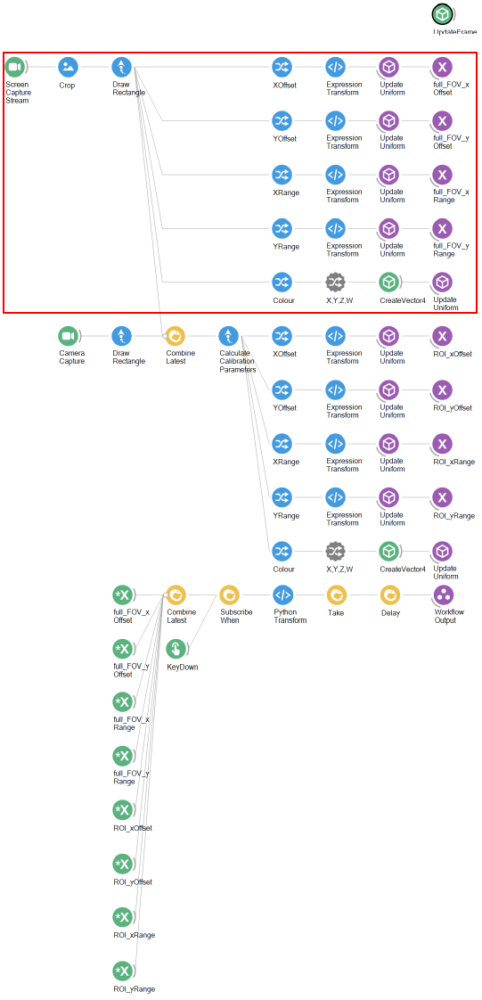

The difference here is that subjects are used to broadcast the calibration values to the workflow.
We still use the `CameraCapture` node to visualize the FOV.
However, we use the `DrawRectangle` node to draw a region onto the camera's FOV.

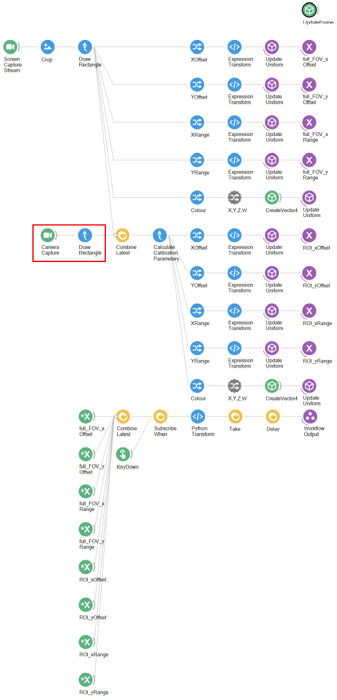

We then combine the calibration values of the `DrawRectangle` nodes from both the `ScreenCaptureStream` pipeline and the `CameraCapture` pipeline.
A `CalculateCalibrationParameters` node recalculates the calibration parameters of the `CameraCapture` pipeline with respect to the `ScreenCaptureStream` pipeline.

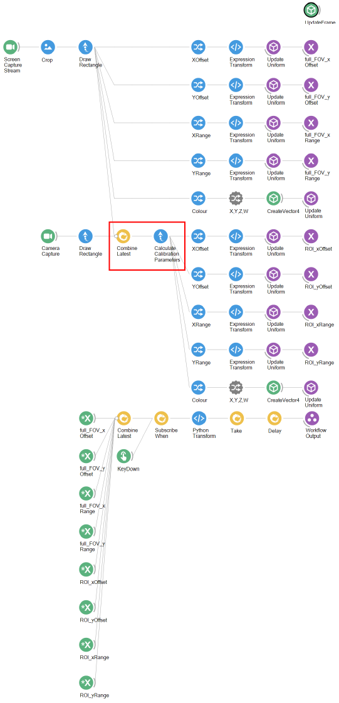

This effectively maps the small ROI drawn onto the camera's image into a set of new calibration parameters.
We use these new calibration values to update the uniform variables of a second vertex shader. 

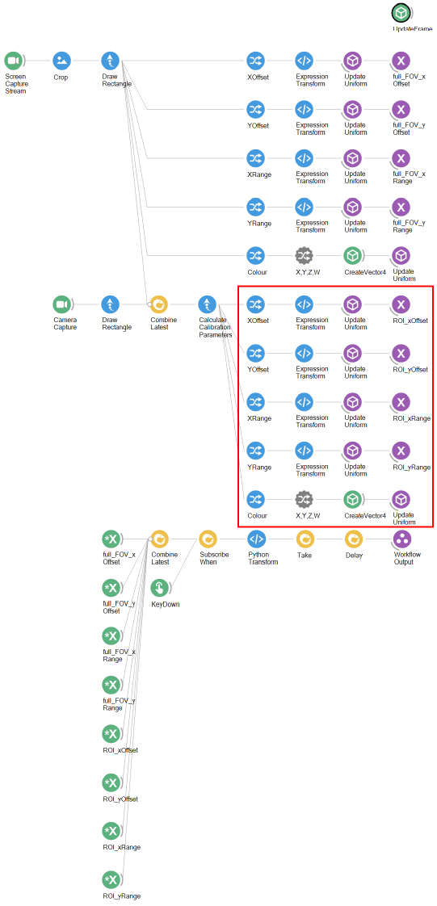

The last step is the same as before.
The calibration values from both the full FOV and the sub region are combined into a single element.
When the `Tab` key is pressed, the data are passed onto a `PythonTransform` which saves the data to csv.
After the data are saved, the workflow waits 1 second and then terminates.

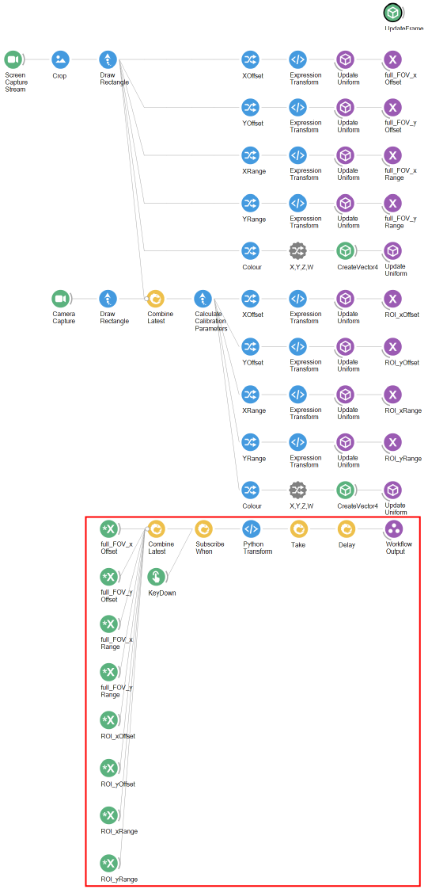

This method can be used to map many subregions within a single FOV.
The same steps can be repeated for more vertex shaders.
