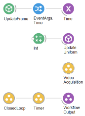
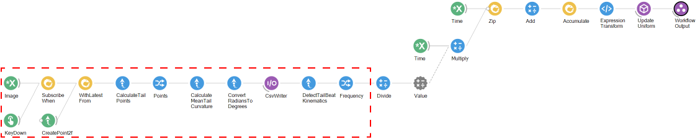
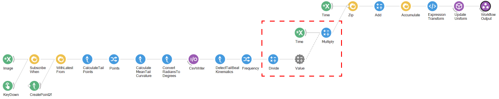
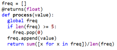
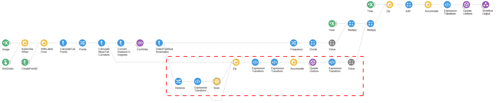
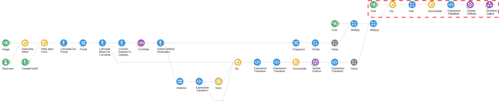

# BonZeb

# Closed-loop head-fixed stimulation
BonZeb's tracking methods can be used to implement closed-loop stimulation.
The examples provided address how closed-loop stimulation can be performed to stimulate optomotor swimming with OMR gratings.
These methods provide a general framework for users to develop closed-loop assays with other forms of stimulation. 

This folder contains the following sections:
1. [1D closed-loop with OMR](#1D-closed-loop-with-OMR)
2. [2D closed-loop with OMR](#2D-closed-loop-with-OMR)

# 1D closed-loop with OMR
Below is an overview of the closed-loop OMR workflow for head-fixed fish.

It follows the general structure of the [timed online tracking](<../Behavioural Tracking and Analysis#timed-online-tracking>) workflow but uses the tracking pipeline from [Head-fixed tracking](<../Behavioural Tracking and Analysis#head-fixed-tracking>).
Below shows the contents of the `ClosedLoop` nested workflow.

Tracking starts when the workflow subscribes to the `Image` subject with the `KeyDown` node.
The `Keydown` node is set to trigger when the `Tab` key is pressed.
In head-fixed animals, there is no need to perform a background subtraction on the images.
Thus, the latest images are combined with a fixed point, generated by the `CreatePoint2f` node.
The `X` and `Y` properties of the `CreatePoint2f` node must be set to the coordinates in the image which represent the animal's centroid.
The tracking pipeline calculates the tail points and the mean tail curvature.
The tail angle is converted into degrees and saved using the `CsvWriter` node.
The tail beat frequency is calculated from the tail angle.

The tail beat frequency gets divided by -20.
Thus, if the tail beat frequency produces a value of 20, the output of the `Divide` node is -1.
This value, representing the gain, is multiplied by the `Time` variable.

The original value of time is zipped together with the frequency multiplied value of time and added together.
The sum of these 2 values, generated by the `Add` node, is accumulated over time by the `Accumulate`.
This value is converted to a float type by the `ExpressionTransform` node and used to update the shader variable `phase` by the `UpdateUniform` node.

The result of this is that when the animal produces no movement, the frequency is 0 and thus the phase of the stimulus increases at a constant rate.
When the fish swims (tail beat frequency > 0), this value is converted into an equivalent time step and multipled by a gain factor.
Decreasing the value of `Divide` will result in increasing the gain value.
A moving average or similar function can be applied to the tail beat frequency over time (i.e. using a `PythonTransform` or `CSharpTransform` node) to simulate the effects of acceleration and deceleration as shown below.

# 2D closed-loop with OMR
We can adapt the workflow from the [1D closed-loop example](#1D-closed-loop-with-OMR) to provide 2D closed-loop feedback.
Below is the adapted `ClosedLoop` nested workflow.

The calculation of tail angle, tail beat frequency remain the same as before.
The initial calculation of the closed-loop velocity using the tail beat frequency also remains the same.

We create a new branch to calculate the angular velocity feedback.
We sample the `Instance` property from the output of the `TailBeatKinematics` in a seperate branch.
We use an `ExpressionTransform` node to convert the boolean output of `Instance` to an integer output.
We pass the integer output of the `ExpressionTransform` node to a `Scan` workflow.

Inside the `Scan` workflow, we use an `ExpressionTransform` node to keep track of the start of a new bout instance.
We increment a counter by 1 for every input in which a bout has been detected.
When no bout is detected, the counter resets.
Below shows what is inside the `Scan` workflow.

The outputs from the `Scan` node, `CalculateMeanTailCurvature` and `Instance` (converted to an integer through the `ExpressionTransform`) are zipped together.
An `ExpressionTransform` node calculates the update to the stimulus orientation by weighting the tail curvature by the relative duration of the bout multiplied by a gain factor.
A second `ExpressionTransform` node checks whether the output is not a number and outputs a 0 or the value converted to a float.
This value is sent to an `Accumulate` node which updates the angle of the stimulus.
The `ExpressionTransform` node connected to the `UpdateUniform` node transforms the stimulus angle to a value between -1 and 1.
This value is used as the value in the `Multiply` node connected to the closed-loop velocity.
This transforms the original closed-loop velocity to account for the stimulus angle in the following manner.
When the stimulus angle is perpendicular to the heading angle, the final velocity of the stimulus turns out to be just the base velocity.
When the stimulus angle is in the opposite direction of the heading angle, the stimulus velocity increases.
When the stimulus angle is aligned with the heading direction, the stimulus velocity decreases.

The final stimulus velocity is calculated the same way as before.
The base velocity and closed-loop velocity are added together and accumulated.
This value is then converted to a float type and used to update the phase of the stimulus.

