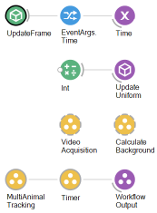
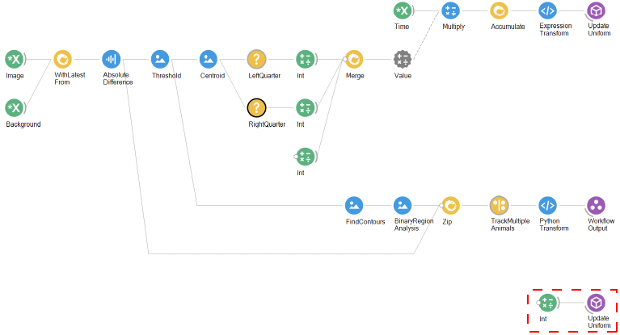
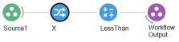
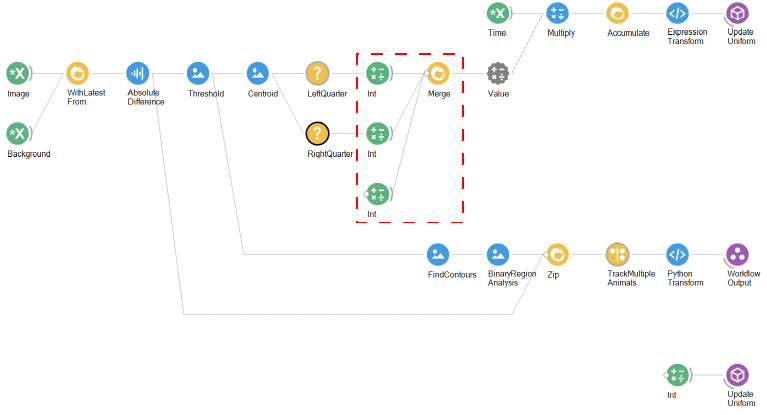
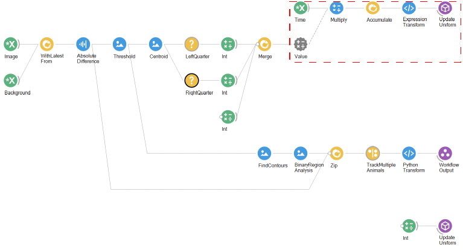

# BonZeb

# Multi-animal tracking
BonZeb's tracking methods can be used to perform behavioural tracking of multiple animals.
The methods used for multi-animal tracking will depend on the specific application.

This folder contains the following sections:
1. [Free-swimming](#free-swimming)
2. [Free-swimming with OMR](#free-swimming-with-OMR)
3. [Free-swimming with multi-prey](#free-swimming-with-multi-prey)

# Free-Swimming
Below is an overview of the method we used for tracking multiple free-swimming animals.

We use the same basic structure for multi-animal tracking as described in [Timed online tracking](<../Behavioural Tracking and Analysis#timed-online-tracking>).
The differences between that workflow and this workflow are contained within the `MultiAnimalTracking` nested workflow. 
Inside the `MultiAnimalTracking` workflow is shown below.

To track the tail angles of multiple fish simultaneously, the first step is to calculate the centroids of all the fish at once.
We perform a background subtraction on the incoming images by combining the `Image` with the `Background` and calculating the `AbsoluteDifference` between them.
We then use a `Threshold` to acquire a binary image.
We pass the output of the `Threshold` node to a `FindContours` node.
The `FindContours` node will compute the contours of the binary regions of the image.
Setting the `MaxArea` and `MinArea` properties can help to discard regions of the binary image that do not correspond to any of the positions of the fish.
The output of the `FindContours` node is passed to the `BinaryRegionAnalysis` node.
The `BinaryRegionAnalysis` node computes the properties of binary regions that are seperated in the image.
The output of the `BinaryRegionAnalysis` node is a `ConnectedComponentCollection` which is essentially a list of all of the binary regions and their associated properties that were computed in the image.

The output of the `BinaryRegionAnalysis` node is zipped with the background subtracted image produced by the `AbsoluteDifference` node.
The contents of the `Zip` are then processed by a `SelectMany` node called `TrackMultipleAnimals`.

It is critical that the `TrackMultipleAnimals` node is a type of `SelectMany` node.
The input to the `TrackMultipleAnimals` node is split into seperate items.
`Item1` represents the `ConnectedComponentCollection` and `Item2` represents the background subtracted frame.
The `ConnectedComponentCollection` is collapsed into a single `ConnectedComponent` object using the `Concat` node.
The `Centroid` of the `ConnectedComponent` object is accessed and combined with the background subtracted image.
When we use the `Concat` function, we concatenate the `ConnectedComponentCollection` into a single `ConnectedComponent`.
When `Concat` is used in this way inside of a `SelectMany`, each `ConnectedComponent`contained within the `ConnectedComponentCollection` gets projected and processed into seperate windows.
Thus, the workflow contained within the `TrackMultipleAnimals` node is projected into as many windows as there are individual `ConnectedComponent` objects contained in the `ConnectedComponentCollection`.
The combined background subtracted image and centroid are then passed as input to a `CreateObservable` node with the name `CalculateTailPoints`.

The `CreateObservable` node named `CalculateTailPoints` node generates an observable sequence for each input.
The input, containing the background subtracted image and the centroid, are then passed to the `CalculateTailPoints` module.
The tail points are calculated and passed as output from the `CreateObservable` node called `CalculateTailPoints`.

The output of the `CreateObservable` node is a type of `Observable` containing a list of points corresponding to the points calculated along the tail.
This output is passed to a `PythonTransform` node.

The `PythonTransform` node essentially parellelizes the operation of calculating the tail points of all fish by subscribing to the `Observable` using a task pool scheduler.
Below is the contents of the `PythonTransform` node.

The `Observable` outputs are then merged together using the `Merge` node and added into a list using the `ToList` node.
The final result is a list of arrays of tail points.
This is sent as the final output from the `SelectMany` node titled `TrackMultipleAnimals`.

This output is processed by a `PythonTransform` node, which generates the final output of the `MultiAnimalTracking` workflow.

The `PythonTransform` node processes and saves the list of arrays of tail points to a csv file called `tracking_results.csv`.
The columns of the csv file represent the data for each fish.
The rows represent the data for all fish in each frame.
Below is the contents of the `PythonTransform` node which performs this process.

# Free-Swimming with OMR
We can adapt the method above for multi-fish tracking to drive changes to visual stimuli.
Below is an example of a workflow where the direction of an OMR stimulus is updated based on the centroid of the group.

We use the `UpdateFrame` node to create the shader.
We broadcast the `EventArgs.Time` property of the `UpdateFrame` node's output into a `Subject` variable named `Time`.
We also initialize the stimulus to solid black.

The `VideoAcquisition`, `BackgroundSubtraction`, and `Timer` group workflows are the same as before.
Below shows the encapsulated workflow of the `MultiAnimalTracking` nested workflow.

The multi-animal tracking portion of the workflow is the same as before.

We add a variable to update the shader to project the OMR stimulus.

We add an additional branch which uses the output of the `Threshold` node in a seperate pipeline.

We use the `Centroid` node to calculate the centroid of the thresholded binary image using the raw image moments.
The output of this `Centroid` node measures the average position of all thresholded regions in the image.
If the `Threshold` successfully captures all of the centroids of the animals and none of the background, then this measures the mean centroid of all animals.
The output of the `Centroid` node is passed to seperate `Condition` nodes.

The first `Condition` node named `LeftQuarter` checks whether the X coordinate of the centroid is less then 250.
The size of our input image is 1000 x 1000 pixels and the arena's edges span all the way to the edge of the image.
This means that when the centroid of the group is less than 250, the group's centroid is in the leftmost quarter of the arena.
Similarly, the `RightQuarter` condition checks whether the X coordinate is greater than 750.
Below is an example showing the encapsulated workflow which sets up the condition for the `LeftQuarter` node.

The output of each of these nodes goes to an `Int` node which outputs either a -1 (if in the leftquarter) or +1 (if in the rightquarter).
Since only one of these conditions can be True at any time, we use `Merge` to merge the outputs into a single stream.
We also merge a third `Int` node with a value of 1.
This value is relevant only at the start of the workflow, when the direction of the stimulus is initialized to travel in one direction.

The outputs of these values are used to multiply time.
The value of the `Time` subject is sent to a `Multiply` node.
The `Value` property of the `Multiply` node is externalized.
Thus, the value of `Multiply` is set to either -1 or 1 depending on the position of the group centroid.
A cumulative sum of this value is maintained using the `Accumulate` node and the `ExpressionTransform` node converts this value from a double to a float for the shader.
The accumulated value is sent to the `UpdateUniform` node which updates the phase of OMR stimulus.

