# BonZeb

# Optogenetic stimulation
BonZeb's tracking methods can also be used to implement optogenetic stimulation.

This folder contains the following sections:
1. [Arduino script](#arduino-script)
2. [Optogenetics workflow](#optogenetics-workflow)

# Arduino script
The setup uses an arduino to control optogenetic stimulation.
We use a custom arduino script to monitor the serial communication port and send digital signals to an LED driver.
Below shows the script.

A set of global variables are defined.
In our configuration, we use a BNC cable with the positive wire connected to the digital pin 8 on the arduino and the negative wire connected to ground on the arduino.
The BNC cable is connected to an LED driver.
We set the `pinNum` to `8` in the arduino code.
We set the `lightOnDelay` to `10` to create a light on pulse with a 10 ms duration.
We set the `lightOffDelay` to `10` to create a light off period of 10 ms.
The frequency of stimulation is calculated as `1000 / (lightOnDelay + lightOffDelay)`.
The `inputChar` variable is the variable we will use to store data captured over the serial communication channel.
The `state` variable is used to determine the state of the arduino given the commands from the computer.

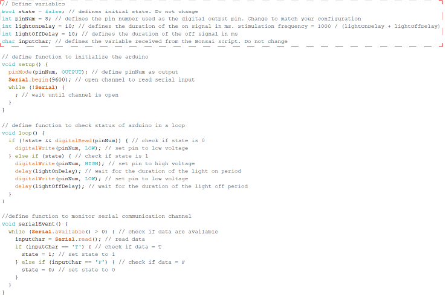

We define a function called `setup` that is used to initialize the state of the arduino.
Inside the function, we establish the pin as output and open the serial communication channel for monitoring data sent from the computer.

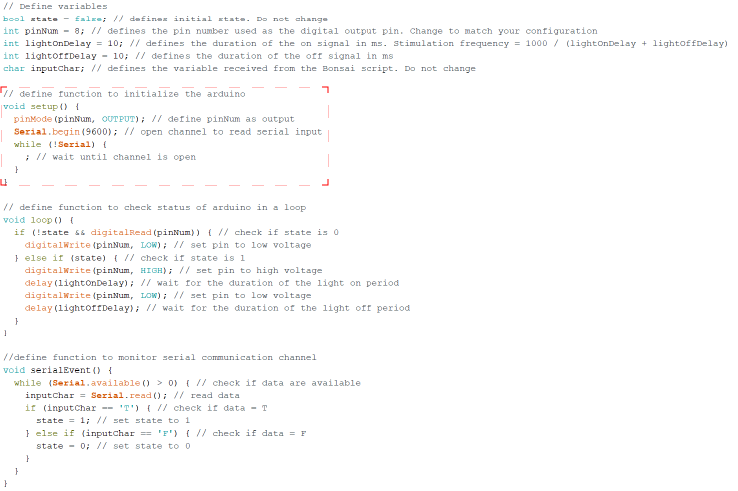

We define a function called `loop` that continuously checks the state of the arduino while it is running.
We set up a series of conditional statements to check the `state` of the arduino and the state of the digital pin using the `digitalRead` function.
If the `state` variable is set to `0` and the voltage of the digital pin is high, the we set the digital pin to a low voltage state.
If the `state` variable is `1`, then we begin stimulation.
Stimulation proceeds such that the voltage of the pin goes high for the `lightOnDelay` period and then low for the `lightOffDelay` period.

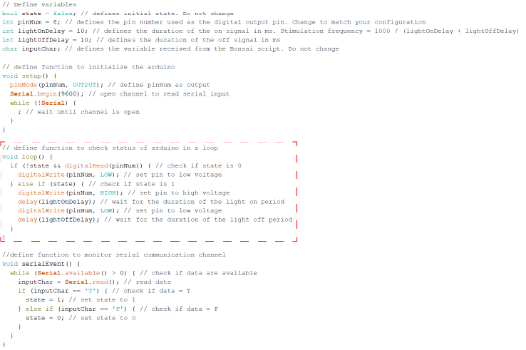

Finally, we define a function to monitor the serial communication channel with the computer called `serialEvent`.
The function checks whether data from the channel is available and reads it.
The function checks whether the data is a `T` for true or `F` for false and sets the `state` variable accordingly.

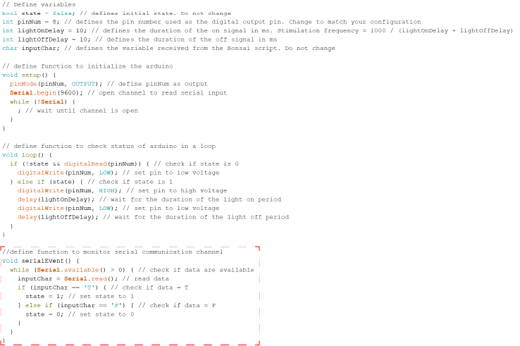

Thus, we can communicate to the arduino to turn on or off the stimulation signal using the serial port recognized by the desktop.

# Optogenetics workflow
Below is the workflow used for optogenetics stimulation.

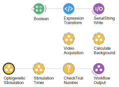

The workflow sends data over serial communication to an Arduino Uno.
We generate a `Boolean` value of `False` at the start of the workflow.
This value is converted to a string in the `ExpressionTransform` node.
We then connect this output to a `SerialStringWrite` node with the `PortName` property set to the serial port of the arduino.

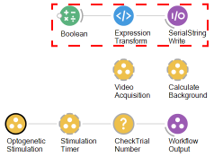

We use the same `VideoAcquisition` and `CalculateBackground` group workflows as in the [timed online tracking](<../Behavioural Tracking and Analysis#timed-online-tracking>) workflow.

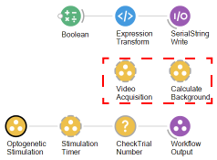

Below shows a slightly modified version of what is inside the `OptogeneticStimulation` workflow.

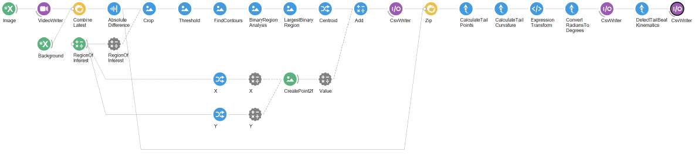

Because we use a multi-well plate and the fish are physically seperated, we can apply the same the essential tracking pipeline for each fish and simply change the parameters of the `RegionOfInterest` for each `Crop` node.
The tracking pipeline is similar to the tracking pipeline used in [basic behavioural tracking and analysis](<../Behavioural Tracking and Analysis#basic-behavioural-tracking-and-analysis>).
We start by performing a background subtraction on the image.

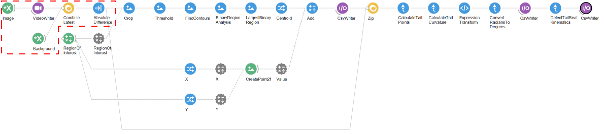

The background subtracted image is cropped to a single well.
This is done by changing the `X`, `Y`, `Width`, and `Height` properties of the `RegionOfInterest` property source node.
The property source node is then connected to an externalized property which determines the parameters of the `Crop` node.

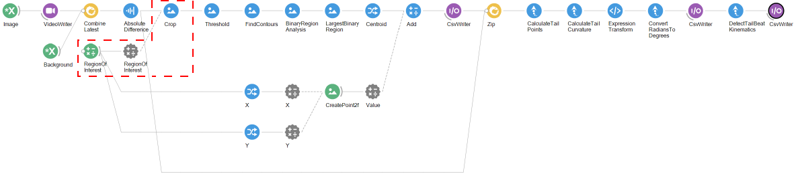

The cropped image is used for extracting the centroid of the fish.
The image is thresholded and processed using a binary region analysis.
The centroid of the largest binary region is used for tracking.

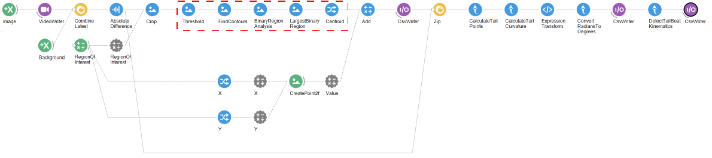

When we process the cropped image, the dimensions of the image are changed.
The centroid that we calculate will be relative to the crop rather than the entire image.
We can work this into our tracking pipline using the `X` and `Y` properties of the `RegionOfInterest` property source to create an offset point using the `CreatePoint2f` node.
This point is then added to the `Centroid` to offset the centroid with respect to the `RegionOfInterest`.
We save this centroid to a csv file.

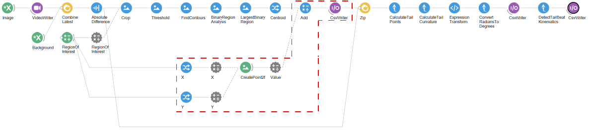

The centroid and the background subtracted image are zipped together and the tail points are calculated.
We then process these into tail angles and take the last angle as the tail curvature.
We convert these values to degrees and save them into a csv file.
The tail angle is used to detect the tail beat kinematics.
The tail beat kinematics are also saved to a csv file.

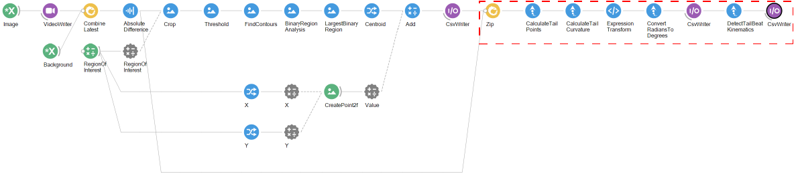

Next, we move onto the `StimulationTimer` workflow which is shown below.

Here, we use a `WorkflowInput` node named `Source1` to initialize the workflow.
We count the number of images produced by the camera over time.
The camera delivers 200 frames per second and 12000 frames per minute.
To determine the appropriate stimulation period, we add 6000 to the cumulative value and divide by 12000.
The value will increase from 0 to 1 after 30 seconds, then from 1 to 2 after 90 seconds, and so on.
We can use this value to determine how many stimulation periods have occurred and send data to the arduino appropriately.

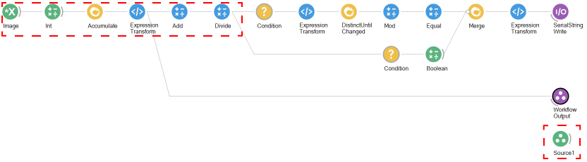

We use a `Condition` node to check whether the value is less than 20 stimulation periods.
If the value is less than 20, we determine whether the stimulation period is odd or even.
To determine whether the stimulation period is odd or even, we use a `Mod` node with the value set to `2`.
We then check if this value is equal to 1.

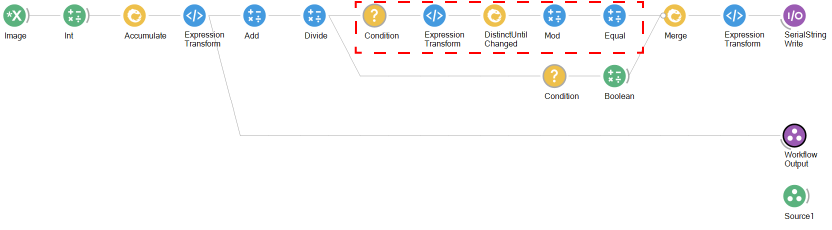

We check if the stimulation period is greater than 20 in a seperate branch with a `Conditional` node.
If the value is greater than 20, then we send a value of `False`.

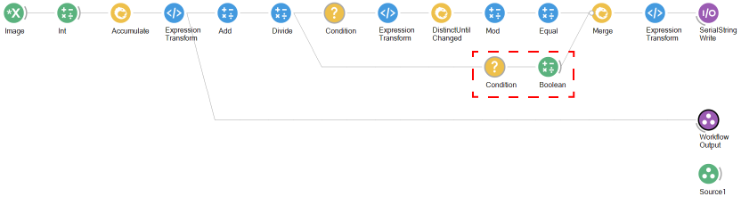

We then `Merge` these branches, convert the boolean input to string, and then send this data to the arduino.
We also send the output of the `ExpressionTransform` node as the `WorkflowOutput`.

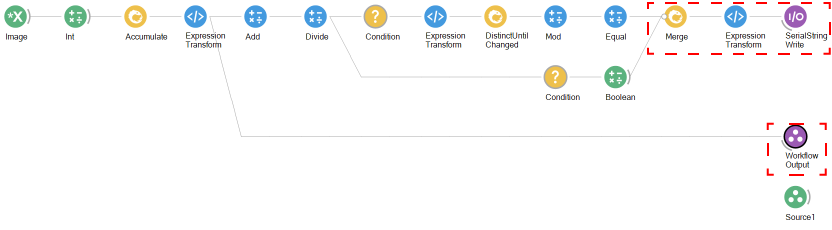

The output of the `StimulationTimer` node is passed to a `Condition` node named `CheckTrialNumber`.
The `CheckTrialNumber` node takes the accumulated number of images and divides it by 12000.
We then check whether the value of this is `GreaterThanOrEqual` to 20.
This produces a value of `True` after 20 minutes of continuous image acquisition and subsequently ends the workflow.

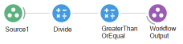
