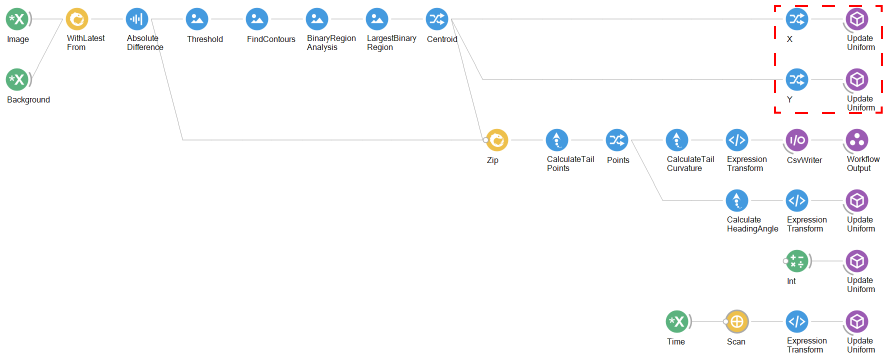
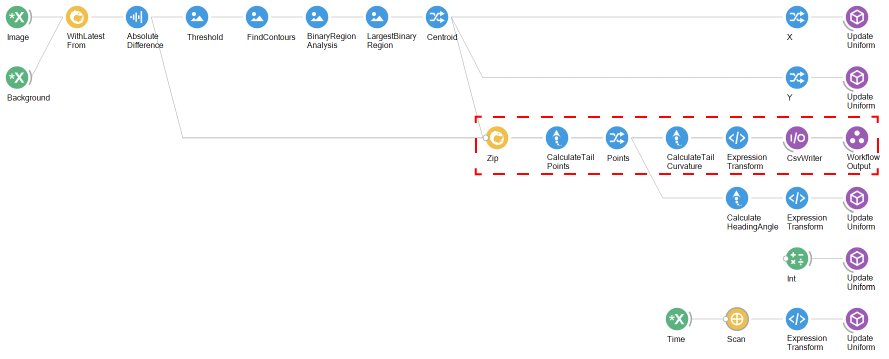
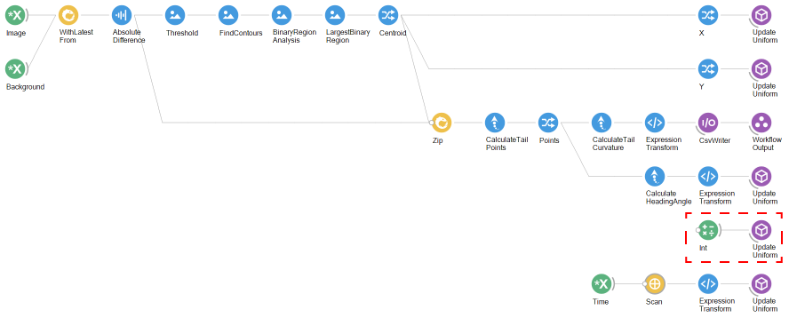
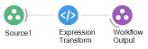

# BonZeb

# Virtual Open-loop Free-Swimming Stimulation
BonZeb's tracking methods can be used to implement virtual open-loop stimulation.
We have developed these tools primarily for studying larval zebrafish behaviour.
These behaviours include predator avoidance with looming stimuli, optomotor swimming with gratings, and prey capture with prey-like stimuli.
While the examples provided here are specific to these stimuli, the methods provide a general framework for users to develop additional virtual open-loop assays. 

This folder contains the following sections:
1. [Virtual open-loop with looming dot](#virtual-open-loop-with-looming-dot)
2. [Virtual open-loop with OMR](#virtual-open-loop-with-OMR)
3. [Virtual open-loop with prey](#virtual-open-loop-with-prey)

# Virtual open-loop with looming dot
Below is an overview of the virtual open-loop workflow.

The workflow for virtual open-loop has the same essential structure as the workflow used in [Multi-animal tracking with OMR](<../Multi-animal Tracking#free-swimming-with-OMR>).
The differences between that workflow and this workflow are contained within the `VirtualOpenLoop` nested workflow. 
Inside the `VirtualOpenLoop` workflow is shown below.

We use the basic tracking pipeline described in the [basic behavioural tracking section](<../Behavioural Tracking and Analysis#basic-behavioural-tracking-and-analysis>).
We perform a background subtraction after combining the latest images with the background.
We apply a binary threshold to the image followed by a binary region analysis.
We use the `LargestBinaryRegion` node to take the region with the largest area in the collection of binary regions.
We sample the `Centroid` property of the result `ConnectedComponents` object produced by the `LargestBinaryRegion` node.

We sample the `X` coordinate property from the centroid and feed that into the `UpdateUniform` node which is connected to the `fish_position_x` variable in the shader.
Similarly, we use the `Y` coordinate of the centroid to feed into the `fish_position_y` variable in the shader through another `UpdateUniform` node.

We zip the background subtracted frame together with the centroid and pass that onto the `CalculateTailPoints` node to calculate the tail.
We sample the `Points` property of the `TailPoints` output and pass that onto the `CalculateTailCurvature` node.
The `ExpressionTransform` node takes the array of tail angles generated by the `CalculateTailCurvature` node and computes the average angle of the last 3 tail angles.
This value is saved to a csv file called `tracking_results.csv` using a `CsvWriter` node.

The tail points are further processed by the `CalculateHeadingAngle` node.
The heading angle is then converted to a float using the `ExpressionTransform` node.
This value is then passed to the `UpdateUniform` node which updates the `angle` variable of the shader.

An `Int` value of 1 is used to initialize the looming stimulus.

The `Time` subject is used to calculate the time to the loom approaching.
A `Scan` node is used to accumulate a value of time that resets after a certain period.

The `Scan` node works similar to a recursive function in other programming languages.
For every input into the `Scan` node, the previous output of the `Scan` node is zipped with the input.
The encapsulated workflow inside of the `Scan` node can access both the new input and the previous output.
The `Accumulation` property of the `Source` contains the previous output.
The `Value` property of the `Source` contains the new input.
In this case, we use an `ExpressionTransform`node to check whether the `Accumulation` is greater than a certain value.
If this evaluates to true, then the output is 0 and the accumulated time resets.
Otherwise, the output is the sum of the `Accumulation` and `Value`.

The output of the `Scan` node is then processed by an `ExpressionTransform` node.
The `ExpressionTransform` checks whether the the accumulated time is greater than certain value.
If the value is greater than this value, then the output is the value.
If the value is less than this value, the the output is the output of the `Scan` node.
This creates the effect of the looming stimulus expanding to a fixed size rather than expanding to completely cover the shader window.
This value is then passed to the `UpdateUniform` node to update the `time` variable in the shader.

The output of the `BinaryRegionAnalysis` node is zipped with the background subtracted image produced by the `AbsoluteDifference` node.
The contents of the `Zip` are then processed by a `SelectMany` node called `TrackMultipleAnimals`.

# Virtual open-loop with OMR
The above workflow provides the basis for all virtual open-loop stimulation protocols.
As you'll see, besides updating the shader, there are very few differences between workflows.
Below is the updated `VirtualOpenLoop` workflow.

The majority of the workflow is the same as the previous example.
A background subtraction is performed on the incoming images and the fish's centroid is calculated.
The X and Y coordinates are passed as uniform variables to the shader.
The tail points are calculated and processed into tail angles, as well as a heading angle for the shader.
The `Time` subject is accumulated and passed to the shader.

# Virtual open-loop with prey
The same workflow used for [virtual open-loop with OMR](<#virtual-open-loop-with-OMR>) also works for virtual open-loop prey.
The difference is in the shader program.
