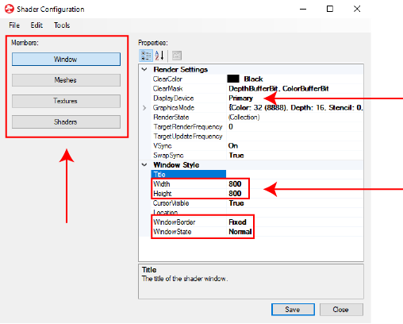
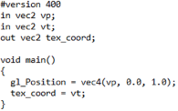
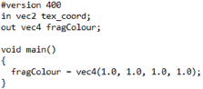

# BonZeb

# Visual Stimulus Library
The visual stimulus library contains the following visual stimuli:
1. Solid black
2. Solid white
3. Black-white flashes
4. Left Phototaxis
5. Right Phototaxis
6. Left Looming dot
7. Right Looming dot
8. Left Optomotor gratings
9. Right Optomotor gratings
10. Converging Optomotor gratings
11. Diverging Optomotor gratings
12. Concentric optomotor gratings
13. Left Optokinetic gratings
14. Right Optokinetic gratings
15. Forward Moving prey
16. Left Moving prey
17. Right Moving prey
18. Left Stationary prey
19. Right Stationary prey

# Bonsai Workflow
The Bonsai workflow demonstrates how to control visual stimuli using variables calculated in Bonsai.
The position and heading angle are simulated in the workflow using the mouse cursor for position and a float variable for heading angle.
In a normal behavioural experiment, these values are calculated using behavioural data captured in real-time.
Below is a picture of the Bonsai workflow that describes what each stream of the workflow is doing.

The stream labelled `Time` provides input to the time variable in the shader.
Each time a new frame is rendered, the `UpdateFrame` node produces an output value.
The `EventArgs.Time` attribute of the output is used to obtain the time between successive updates of the shader window.
The `Accumulate` node keeps track of the time in seconds since the start of the workflow.
The output of the `Accumulate` node feeds into the time variable of the shader.

The stream labelled `Simulated Fish Position` provides the inputs to the fish x and y position variables in the shader.
When the mouse cursor crosses into the the shader window, the `MouseMove` node produces an output.
The `NormalizedDeviceCoordinates` node maps the position of the cursor to coordinates relative to the shader.
`ExpressionTransform` nodes are used to extract the x and y coordinates into seperate streams.
The x and y coordinates are normalized once more inside the `ExpressionTransform` node.
The coordinates are converted to floats using the `single()` function inside the `ExpressionTransform`.
The output of each `ExpressionTransform` node is passed to the x and y position variables in the shader, respectively. 

The stream labelled `Stimulus Number` determines the visual stimulus number.
The output of the `Integer` node is sent to the stimulus number variable in the shader.

The stream labelled `Simulated Heading Angle` provides the inputs to the fish heading angle variable in the shader.
The output of the `Float` node is passed to the fish heading angle variable in the shader.

# Shader Configuration
To open the shader configuration dialogue, double click on the `UpdateFrame` node.
The first set of properties correspond to the `Window` parameters.

In the `Render Settings` section, the `Display Device` property sets which video display to render the shader window onto.
Under `Window Style`, changing the height and width will change the resolution of the shader window.
Changing the `Window border` will determine whether the shader window can be resized, fixed, or borderless.
The `State` property determines whether the shader should be started normally, fullscreen, minimized, or maximized.

A mesh must be set in the `Meshes` menu as follows.

A mesh defines the area inside a window that will contain the shader.
A mesh with the type `TexturedQuad` is added to the list of meshes, but other types of OpenGL meshes can be added as well.
The `Name` property attributes the mesh a variable name that will be used for the defining the shader.
Changing the `QuadEffects` property will flip the visual stimulus.

The `Textures` tab alows you to instantiate and specify textures which will get rendered onto the shaders.
For this example, no textures are added to the shader.

A shader must be specifed in the `Shaders` menu as follows.

A `Material` is added as the type of shader.
The same variable name as the mesh or a new variable name can be ascribed to the `Name` property of the shader.
The `Name` of the shader will become available to other nodes inside the Bonsai workflow.
The `FragmentShader` property is given the path of the fragment file (.frag) which defines how we compute values for each coordinate in the shader.
The `VertexShader` property is set to the path of the vertex file (.vert) which defines how we map coordinates of the material into fragments.
The `MeshName` property takes the name of the mesh defined in the `Meshes` section.

# Fragment and Vertex Files
Fragment and vertex files are essential components of the OpenGL shader rendering pipeline.
The vertex file (ending in .vert) processes vertices.
Vertices map areas of the shader window into a texture space to be processed by the fragment file.
The vertex coordinates, given by vp, range from -1 to 1.
Below is an example of a vertex file.

The fragment file (ending in .frag) receives texture coordinates and processes these into fragments.
Fragments determine what colour value to assign to each coordinate.
The texture coordinates processed by the fragment shader range from 0 to 1.
Below is an example of a fragment file.

Together, the vertex and fragment files work to render visual stimuli to the shader window.
