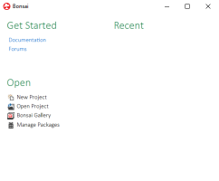
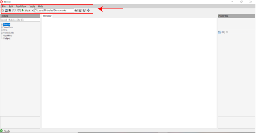
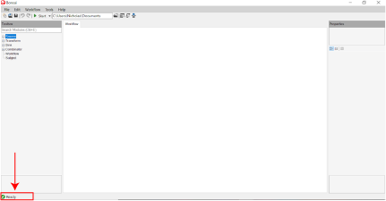

# BonZeb

# Getting Started - Bonsai Interface
When you run Bonsai, two windows will appear.
One window displays the Bonsai workflow space and is used for building Bonsai code.
The terminal window is not used for programming in Bonsai, but will display error codes or print statements as they appear from Bonsai at runtime.
Below is a picture of the IDE.

# Menubar
The `Menubar` can be found at the top of the interface. 
There are several useful tabs to select from in the menu.
Notably, you will find the `Package manager` under `Tools`.
The icons can be used to save a workflow, open a new workflow, start and stop a workflow, and more.

# Toolbox
This can be found at the leftside of the interface. 
This is where modules can be browsed or selected. 
If you know which module you are looking for, you can type it into the search bar. 
To add a module to the workflow, select a module from the toolbox and click and drag it onto the workflow.
Alternatively, you can select and press enter, or double click on the module in the toolbox to bring the module into the workflow. 
At the bottom of the toolbox section, there is a box which displays a general description of the module selected inside the toolbox.

# Properties
This is found at the rightside of the interface. 
There is a box at the top for displaying a general description of the module that has been selected in the workflow. 
Underneath this is where a module’s properties can be set by the user. 
Each module has a unique set of properties, and some modules do not have any user-defined properties. 
At the bottom, there is the property descriptions section which provides a description of the property that has been selected.

# Statusbar
The statusbar is found at the bottom left corner of the interface. 
Bonsai is a compiled language, so a compiler is run before the start of a workflow to check if there are any outstanding errors in the workflow before starting. 
The statusbar will display a red X and an error message if there are any errors detected in the construction of the workflow. 
The module in the workflow that is producing the error will also turn red to indicate which node in the workflow is causing the error. 
If no errors are detected before runtime, the statusbar will display a green checkmark when ready.

# Workflow
The workflow is located in the center of the IDE.
The workflow space is where users add modules and build connections between them to form data streams.

