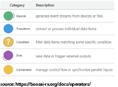
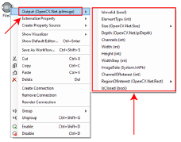
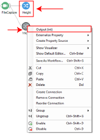
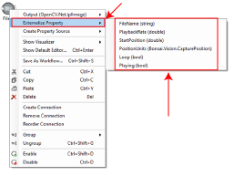
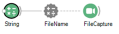
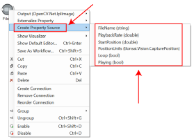
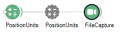
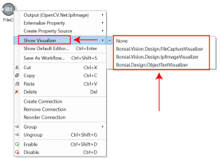

# BonZeb

# Understanding the Basics of the Bonsai Language
It’s a bit tricky to summarize all of the basics of Bonsai in brief.
There will be things that I overlook or do not explain in great detail. 
The developers of Bonsai do a magnificent job explaining concepts and I highly recommend users to read [this](https://bonsai-rx.org/docs/observables/).

# Observable Sequences
Bonsai (Bonsai-Rx) is built in C#/.NET and is based on the [ReactiveX (Rx)](http://reactivex.io/) programming architecture. 
Bonsai is an object-oriented, compiled programming language with a visual programming interface that operates using observable sequences. 
Observable sequences are essentially streams of data. 
Nodes are connected together to perform operations on observable sequences.
A downstream node subscribes to an event from an upstream node and becomes notified to perform some operation when data becomes available. 

There are 2 major types of observable sequences, hot and cold. 
An observable sequence is hot if it continuously produces new data regardless of whether downstream nodes are subscribed to it or ready to receive new input. 
An observable sequence is cold if the observable sequence waits to produce new data until the downstream nodes are all subscribed and ready to accept new input. 
I like to use a bakery as an analogy to explain this difference. 
A bakery produces a loaf of fresh bread once every hour.
The bakery throws out fresh bread if there is bread leftover from the previous hour.
If the bakery sells the previous load and a new customer comes in, the customer must wait until the next loaf of bread is produced after the hour.
In this case, the observable sequence produced by the bakery would be hot because bread is produced at a constant rate, regardless of how much bread was left from the previous hour and will not produce bread faster than the rate it is producing fresh bread, even if customers are willing to pay. 
Another bakery only produces bread when a request is received from a customer. 
In this case, the observable sequence is cold because the bakery will wait to bake bread until a customer has ordered and is waiting to receive the bread.
These two different types of observable sequences can lead to vastly different outcomes and behaviours.

# Types of Nodes
There are a few major classes of modules in Bonsai: sources, transforms, conditionals, sinks, and combinators. 

Sources produce data and are usually the upstream of a pipeline. 
Source nodes consist of cameras, Arduinos, audio recording devices, timers, etc. 
Transforms take an input and produce an output. 
Some transforms will output the same data type as the input whereas other transforms will take one data type input and produce a different data type. 
Conditionals apply some operation to filter the input, similar to if statements in other programming languages, except the output is the original input and the condition is a boolean operation that is used to decide when to pass along data. 
Sinks perform side operations on the input without modifying the data.
Source nodes consist of modules for saving data to a csv file, sending commands to an Arduino, writing videos, etc. 
Combinators are a large class of nodes.
It is difficult to ascribe a function to the class of combinators because each combinator has a specific behavior.
Groups, a type of combinator, allow you to package specific data streams into a single module.
Other combinators are used to combine or expand observable sequences.
Knowing the specific operations of each combinator requires mastering the Bonsai programming language. 

# Data Types
The inputs and outputs of modules in Bonsai are data types, similar to data types in other programming languages. 
Bonsai contains standard data types, such as integers, floating point numbers, character strings, etc. 
The output of a module can be a standard data type or a data structure.
For example, the output type of the FileCapture module, a module which reads a video from a file and outputs the frames inside a bonsai workflow, is an OpenCV.Net.IplImage. 

The IplImage data type comes from the OpenCV.Net library and is a complex data structure that not only contains the image itself, but also contains a number of relevant properties, such as the height and width of the image, the number of channels, etc. 
You can view the output type of any module along with it’s associated properties by right clicking the module in the workspace and browsing the output.

# Member Selectors
The properties of any output can be accessed individually by selecting the property or by using the `MemberSelector` node. 
You can then pass these output properties as specific inputs to downstream modules. 
Both the Height and Width properties of the IplImage data structure are integers. 
These new outputs, which are downstream of the FileCapture module, can now be visualized or passed as specific inputs to other downstream nodes.

# Externalized Properties and Property Mapping
Each module is equipped with its own unique set of user-defined properties.
The values of these properties can be set in the properties interface. 
Some of these properties will update while a workflow is running whereas others may only update after the workflow has restarted.
In addition to changing the properties manually, it is possible to set the value of these properties within the workflow itself using externalized properties and property mapping.
Properties can be externalized to become accessible within the Bonsai workflow. 
Externalize the property of a module by right-clicking a node and selecting the property to externalize from the `Externalize Property` list.

The output of a module can be passed as the input to a property. 
This can be used to change the property of a single module, multiple modules, at the start of a workflow, or dynamically. 
The `PropertyMapping` module can be used to map multiple inputs to different properties of a module in a single node. 
The `InputMapping` node differs from the `PropertyMapping` node in that it synchronizes the update of a property to the timing of an input. 
For example, a `String` node can be used as input to the `FileName` externalized property of the `FileCapture` node.

Once a property has been externalized, the name and description of the property can be set manually. If the property of a node is set in the properties section but also has the same property externalized, then the externalized property will override the property set in the node’s properties section. Additionally, setting the property of a node in the properties section will not propagate upstream to the value of the externalized property, so it is important to remember that if a property has been externalized, the value of the upstream externalized property must be set in order to update the property of the node downstream. 

# Property Source
A property source is used to generate a source node corresponding to a property of a node. 
The property source will generate the same data type of the property selected. 
The property source can be used to set the property of a node or multiple nodes using property mapping as discussed above. 
This is a useful technique for creating a source node for a specific data type and broadcasting the property to nodes throughout the workflow.
To generate a property source, right-click a module select the property from the `Create Property Source` list.

For example, the `PositionUnits` property of the FileCapture module uses a specific data type called CapturePosition from the Bonsai.Vision Library.
This data type is not available as a source module in the toolbox, so a `PositionUnits` property source can be generated from the FileCapture module.
The `PositionUnits` property source can then be used to set the PositionUnits property of the FileCapture module.

# Visualizers
Visualizers allow users to view the observable sequence generated by each module.
Visualizer windows appear when a workflow is started and the node attached to the visualizer window is in operation. 
Each module has a different set of visualizers that are specific to the data type of the output. 
For example, the image associated with IplImage data type can be viewed online with the unique IplImage visualizer available from the `Bonsai Vision Design` package.

Data types can have multiple visualizers.
In the above example, the `ObjectTextVisualizer` shows descriptive text describing some of the properties of the incoming images, such as height and width. 
Double-clicking on a node while the workflow is running will open the first visualizer of a module.
