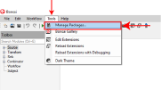
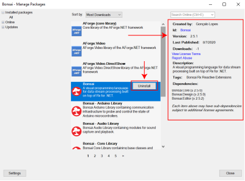
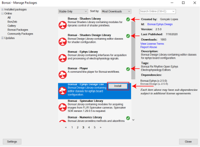
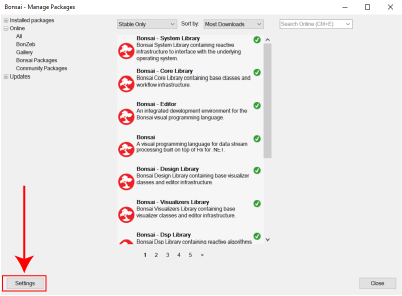
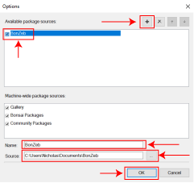

# BonZeb

# Accessing the Package Manager
Bonsai’s package manager is integrated into Bonsai’s interface and provides a convenient way to install online and local bonsai packages to the Bonsai IDE.
Users can access the package manager from the `Getting Started` window.

Users can also access the package manager from within the Bonsai IDE.
The package manager can be accessed by going to the `Tools` menu and selecting `Manage Packages...`.

# Package Manager
On the left side, users can select and view packages which are currently installed by selecting the `Installed packages` tab and selecting `All`.
This will show all of the Bonsai packages and package dependencies that have been installed in the packages section.

If you select one of the installed packages in the packages section, an option to uninstall will appear.
On the right side, you will find information about the selected package, such as a description of the package's contents, the author of the package, and the packages dependencies.
If you select uninstall, this will remove the package from the Bonsai IDE.
Note: packages which have other packages dependant on them cannot be uninstalled until all of the dependant packages are uninstalled first.

In the online section, users can browse `All` packages or can browse a subset of packages.
Bonsai’s core packages can be found in the `Bonsai Packages` tab. 
Users can also browse `Community Packages`, packages that have been published online by developers in the Bonsai community. 
The search bar can be used to look for specific packages online. 
When a package is selected, an option to install the package will appear if the package is not already installed.
Packages that are already installed are shown with a green checkmark.

# Adding a local package
To add a local Bonsai package to the package manager, users must select the settings button on the bottom left corner of the package manager to be brought to the settings page.

A new window will appear where users can add a local package to the package manager. 
The first step is to select the add button on the top right corner of the settings window. 
Enter a name for the package (this name will be how the package manager displays the package) and the path to the package folder saved on the computer.
Make sure the package has been checked is the list of available package sources.
Once all of this is set, press the `OK` button in the bottom right.

After the above steps, the package will be made available inside of the package manager.
The new package is available to download under online packages.
