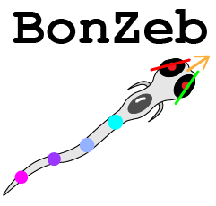
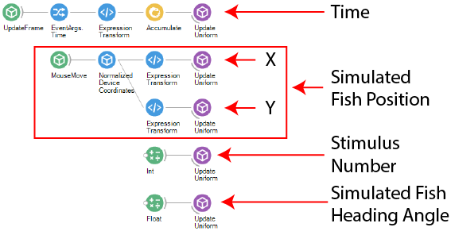
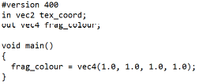
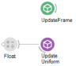
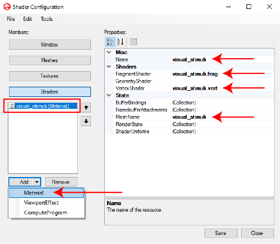

# BonZeb

# Shaders
BonZeb was built to interface with the Bonsai Shaders package to generate visual stimuli.
The Bonsai Shaders package utilizes OpenGL for rendering visual graphics. 
Bonsai Shaders provide extensive flexibility for programming in OpenGL. 
Visual stimuli in BonZeb are generated using a vertex file and a fragment file.

# Fragment and Vertex Files
Fragment and vertex files are essential components of the OpenGL shader rendering pipeline.
The vertex file (ending in .vert) processes vertices.
Vertices map areas of the shader window into a texture space to be processed by the fragment file.
The vertex coordinates, given by vp, can range from (-1, -1) to (1, 1), where each of these coordinates represent opposite corners of the shader window.
Below is an example of a vertex file.
In this case, we define the vertices to be in the furthest corners of the shader window so that the shader will be rendered to the entire window.

The fragment file (ending in .frag) receives texture coordinates and processes these into fragments.
Fragments determine what colour value to assign each coordinate.
The texture coordinates processed by the fragment shader range from (0, 0) to (1, 1).
Below is an example of a fragment file.
In this case, we colour each fragment white.

Together, the vertex and fragment files work to render visual stimuli to the shader window.
The result of this shader when run will be a white rectangle displayed to the entire window.

# Bonsai
The `UpdateFrame` node is needed inside the Bonsai workflow to configure the shader.

# Shader Configuration
The Bonsai shader configuration window specifies the shader's rendering properties and rendering environment. 
To open the shader configuration dialogue, double click on the `UpdateFrame` node.
The first set of properties correspond to the `Window` parameters of the shader.

In the `Render Settings` section, the `Display Device` property sets which video display to render the shader window onto.
Under `Window Style`, changing the height and width will change the resolution of the shader window.
Changing the `Window border` will determine whether the shader window can be resized, fixed, or borderless.
The `State` property determines whether the shader should be started normally, fullscreen, minimized, or maximized.

A mesh must be set in the `Meshes` menu as follows.

A mesh defines the area inside a window that will contain the shader.
A mesh with the type `TexturedQuad` is added to the list of meshes, but other types of OpenGL meshes can be added as well.
The `Name` property attributes the mesh a variable name that will be used for the defining the shader.
Changing the `QuadEffects` property will flip the visual stimulus.

The `Textures` tab alows you to instantiate and specify textures which will get rendered onto the shaders.
For this example, no textures are added to the shader.

A shader must be specifed in the `Shaders` menu as follows.

A `Material` is added as the type of shader.
The same variable name as the mesh or a new variable name can be ascribed to the `Name` property of the shader.
The `Name` of the shader will become available to other nodes inside the Bonsai workflow.
The `FragmentShader` property is given the path of the fragment file (.frag) which defines how we compute values for each coordinate in the shader.
The `VertexShader` property is set to the path of the vertex file (.vert) which defines how we map coordinates of the material into fragments.
The `MeshName` property takes the name of the mesh defined in the `Meshes` section.

# Uniform Variables
Uniform variables allow you to pass variables from the Bonsai workflow to the shader. 
Uniform variables are defined inside the shader and are used to calculate parameters of the visual stimuli.
Below is an example, which defines a uniform variable inside the fragment file of the shader.
In this example, the uniform variable `scale` is used to modify the grayscale values of each fragment.

Bonsai workflows can feed input to uniform variables using the `UpdateUniform` node.
Set the shader name property of the `UpdateUniform` node to the name of the shader defined during configuration.
Set the uniform variable property to the name of the variable defined inside the shader.
Then, a pipeline is set up to feed data from Bonsai to the uniform variable.
In the example below, a `Float` value is passed to the `UpdateUniform` node, which will determine the scale value of the fragments in the shader. 

In this case, the scale only changes value when we manually change the value of `Float`. 
We can go a step further and use a dynamic input to the uniform variable.
Below is an example where a dynamic value is generated inside the Bonsai workflow and processed by the shader.

A `MouseMove` node calculates the position of the mouse cursor in the shader window. 
The `NormalizedDeviceCoordinates` transforms (normalizes) the coordinates of the mouse with respect to the shader window to map the values of the cursor from -1 to 1. 
An `ExpressionTransform` node maps the values of the x coordinate between 0 and 1 for the fragment shader and converts this to a float type using the single function. 
The output is then passed to the `UpdateUniform` node.
In this way, the grayscale intensity of the shader window is dependant on the x position of the mouse, which changes as the cursor moves from left to right across the shader window.
