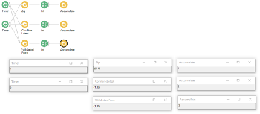
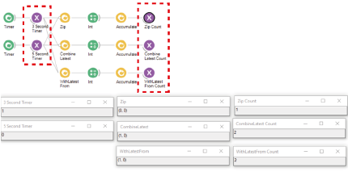
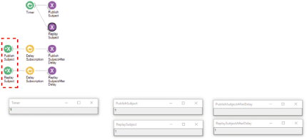
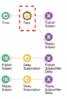
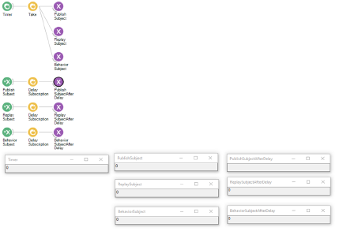

# BonZeb

# Subjects
Subjects are a useful way to take the output of any module in any data stream and broadcast it to other parts of the workflow. 
Subjects are similar to global variables in other programming languages/
There are different ways to define subjects to produce different workflow behaviours. 
Below is an example demonstrating how to use subjects and why they are important.
There are two timers set to produce a value every 3 seconds and a value every 5 seconds, respectively.
The outputs of each `Timer` are combined in 3 seperate data streams using `Zip`, `CombineLatest`, and `WithLatestFrom`.
Every time the combinators produces a value, an `Int` of 1 is accumulated with an `Accumulate` node to observe the total number of outputs from each combinator. 

This is an example of a workflow with no subjects. 
Can you tell which timer is firing at 3 seconds or 5 seconds? 
Is it the timer in the top pipeline or is it the timer on the bottom? 
Do you know which accumulate corresponds to which data stream? 
If you had access to the properties section of each Timer, then you could determine which node was which.
However, the timer cannot be inferred based on the visualizer alone. 
The same is true about which accumulate modules are associated with which data sequence.
Subjects can be used not only to broadcast variables, but can be used to assign relevant variable names to each output.

`PublishSubject` nodes were added in the example to help understand the behaviour and output of each timer/combinator.
Subjects are a type of sink, meaning they simply pass along the input from upstream nodes to downstream nodes without modifying the input.
In this example, subjects were used to provide each timer with a relevant variable name.
Visualizing the outputs of the subjects rather than their associated upstream node allows us to distinguish which data stream we are visualizing. 

Different types of subjects produce different behaviours. 
`PublishSubject` changes a cold observable sequence into a hot sequence.
`ReplaySubject` turns a hot sequence into a cold sequence.
`BehaviorSubject` is similar to `ReplaySubject` except that it will wait for subscription even if the sequence it is broadcasting has been terminated. 
The `MulticastSubject` pushes values from one data stream into a subject originating from another data stream. 
`SubscribeSubject` gives access to the observables of a subject. 
Depending on where subjects are placed inside of group nodes, they will only broadcast the subject within the group node and not to the entire global workflow. 
More information about subjects can be found [here](https://bonsai-rx.org/docs/subjects/).

It is important to understand the difference in behaviors between subjects. 
In the example below, a `Timer` is set to fire every 2 seconds.
The output is passed to a either a ReplaySubject or PublishSubject. 
In separate data streams, a SubscribeSubject is used to access the variables from either the ReplaySubject or PublishSubject. 
A `DelaySubscription` module is used for each `SubscribeSubject` which delays the subscription of data for 3 seconds.

After 2 seconds, the timer produced a value which was sent to both the `PublishSubject` and `ReplaySubject`. 
The `DelaySubscription` modules did not subscribe to the `SubscribeSubject` nodes for the `PublishSubject` and `ReplaySubject` variables until after 3 seconds. 
Once 3 seconds had passed, both DelaySubscription modules subscribed to the `PublishSubject` and `ReplaySubject` modules. 
Only the data stream subscribing to the `ReplaySubject` produced a value. 
This difference in behavior can be explained by the temperature of the observable sequence (i.e. hot vs cold).
The `PublishSubject` module generates a hot observable sequence whereas the `ReplaySubject` module generates a cold sequence.
Since the `PublishSubject` module did not produce any new values once the `DelaySubscription` node had subscribed to it, the value of the timer that was sent to the `PublishSubject` had been essentially discarded. 
This is not the case for the `ReplaySubject` module, which had generated a cold observable sequence. 
When the `DelaySubscription` module subscribed to the `ReplaySubject` even after the timer produced a value, the `ReplaySubject` produced the most recent value of the sequence. 
After letting the workflow run for a longer period of time, eventually both streams subscribing to the `PublishSubject` and `ReplaySubject` nodes receive the value of the timer once the timer produced a value.
To illustrate another important point, a `Take` module is placed after the timer to terminate the sequence after the first value is produced.

After running this workflow for 3 seconds, the workflow stops when the time to subscribe by the `DelaySubscription` modules elapses. 
The source node generating observables for both the PublishSubject and ReplaySubject terminates after the first value is produced.
Thus, even the `PublishSubject` and `ReplaySubject` nodes are incapable of producing values.
Since no more values are capable of being produced throughout the entire workflow, the workflow terminates.
Below, a `BehaviorSubject` is added into the workflow.

After 3 seconds, the workflow continues to run despite the fact that no more values are being produced. 
`BehaviorSubject` will wait to produce a value to any modules subscribing to the sequence, even after the data stream producing the values has terminated.
This only works if a subscriber is issued to `BehaviorSubject`.
If you remove the `SubscribeSubject` for the `BehaviorSubject` variable, the behaviour of the workflow will return to what it was previously and terminate after 3 seconds.
