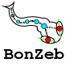

# BonZeb

# Table of Contents
1. [Preface](#preface)
2. [Download](#download)
3. [Dependencies](#dependencies)
4. [Getting Started with Bonsai](#getting-started-with-bonsai)
5. [Video Acquisition](#video-acquisition)
6. [Behavioural Tracking and Analysis](#behavioural-tracking-and-analysis)
7. [Visual Stimulation](#visual-stimulation)
8. [Calibration](#calibration)
9. [Open-loop Free-swimming](#open-loop-free-swimming)
10. [Closed-loop Head-fixed](#closed-loop-head-fixed)
11. [Multi-animal Tracking](#multi-animal-tracking)
12. [Optogenetics](#optogenetics)
13. [Calcium Imaging](#calcium-imaging)
14. [Acknowledgements](#acknowledgements)

# Preface
BonZeb is a [Bonsai](https://bonsai-rx.org/) library for high-resolution zebrafish behavioural tracking and analysis. 
Bonsai-Rx provides a useful programming framework for applications in behavioural neuroscience. 
BonZeb provides essential tools for zebrafish researchers looking to implement closed-loop and open-loop behavioural feedback with visual stimulation.
BonZeb is built on top of the Bonsai framework and users will need to be somewhat familiar with Bonsai before getting started.
For more information, please check out Bonsai's forums at [Gitter](https://gitter.im/bonsai-rx/Lobby) and [Google Groups](https://groups.google.com/forum/#!forum/bonsai-users)

# Download
This package was originally built in Bonsai version 2.4.0 but should work for newer versions of Bonsai as well. 
You can download the latest [Bonsai](https://bonsai-rx.org/docs/installation/) or go to the [Bonsai Archives](https://bitbucket.org/horizongir/bonsai) to download earlier versions.
BonZeb can be easily downloaded using Bonsai's built-in package manager. 
BonZeb can also be added to Bonsai manually by downloading the [GitHub Repository](https://github.com/ncguilbeault/BonZeb) and adding it to the package manager.
To add the package manually to the package manager, navigate to settings and add the .nuget folder of the repository to the list of available package sources. 

# Dependencies
When installing BonZeb, all of the essential dependencies will be installed automatically. To implement the example workflows, users must also install the following Bonsai libraries:

* Bonsai - Arduino Library
* Bonsai - Core Library
* Bonsai - Design Library
* Bonsai - Dsp Library
* Bonsai - Dsp Design Library
* Bonsai - Editor
* Bonsai - Player
* Bonsai - Scripting Library
* Bonsai - Shaders Library
* Bonsai - Shaders Design Library
* Bonsai - System Library
* Bonsai - System Design Library
* Bonsai - Video Library
* Bonsai - Video Design Library
* Bonsai - Vision Library
* Bonsai - Vision Design Library
* Bonsai - Windows Input Library

# Getting Started with Bonsai
Bonsai is a powerful programming language with a visual programming interface that uses graphs, also called workflows, to represent data processing pipelines in the interactive development environement (IDE). 
The nodes in a Bonsai workflow, also called modules, can represent a variety of different Bonsai objects, such as data sources, transformations, combinators, or sinks. 
Modules in a workflow are linked by edges to form pipelines, also called data streams, where the output of one node is sent as input to another node. 
The basic premise for building Bonsai workflows is adding nodes into the workflow and connecting nodes together to form pipelines or data streams. 
Data streams can be split and merged together in various ways such that the final workflow can have multiple data streams operating synchronously or asynchronously, simultaneously.
If you are just learning about Bonsai for the first time, see the `Getting Started` folder to learn more about the basics of Bonsai. If you are already familiar with Bonsai and how it works, feel free to skip this section.

# Video Acquisition
BonZeb provides modules for interfacing with Allied Vision, Teledyne Dalsa, and Euresys CameraLink Frame Grabber hardware devices for high-speed video acquisition.
Users must install the manufacturers software development kit (SDK) and ensure the camera is connected to the computer and working properly before using the camera in Bonsai.
Both the Allied Vision and Teledyne Dalsa modules require bonsai to be run in no boot mode. To do this, Bonsai must be started from the command line with the following argument:

`Bonsai.exe --noboot`

# Behavioural Tracking and Analysis
BonZeb provides many different modules for behavioural tracking and analysis including methods for centroid tracking, tail tracking, eye tracking, and tail beat analysis.
See the `Examples\Behavioural Tracking and Analysis` folder for how to perform online behavioural tracking and analysis and offline tracking with batch processing.

# Visual Stimulation
BonZeb can be used with Bonsai Shaders to generate closed-loop and open-loop visual stimuli with controlled behavioural feedback.
The Bonsai Shaders package utilizes OpenGL for rendering visual stimuli and offers immense flexibility.
See the `Examples\Visual Stimulation` folder for how to generate visual stimuli such as optomotor gratings, optokinetic gratings, looming dots, small prey, and phototaxic stimuli.

# Calibration
BonZeb provides a simple solution for users to perform calibration of visual display devices.
Users can use BonZeb to map the area used for visual stimulus rendering to a camera’s field of view (FOV) or a specified region within the FOV.
See the `Examples\Calibration` folder for how to calibrate visual display devices for rendering visual stimuli.

# Open-loop Free-swimming
BonZeb provides examples for how to build and implement open-loop free-swimming behavioural assays. 
See the `Examples\Open-loop Free-swimming` folder for how an open-loop free-swimming behavioural assay can be used and implemented.

# Closed-loop Head-fixed
BonZeb provides examples for how to build and implement closed-loop head-fixed behavioural assays. 
See the `Examples\Closed-loop Head-fixed` folder for how a closed-loop head-fixed behavioural assay can be used and implemented.

# Multi-animal Tracking
BonZeb provides examples for how to perform multi-animal free-swimming and head-fixed tracking. 
See the `Examples\Multi-animal Tracking` folder for how to perform multi-animal free-swimming and head-fixed tracking.

# Optogenetics
BonZeb provides examples for how to perform optogenetics. 
See the `Examples\Optogenetics` folder for how to implement an optogenetic stimulation paradigm.

# Calcium Imaging
BonZeb provides examples for how to perform calcium imaging with closed-loop visual stimulation. 
See the `Examples\Calcium Imaging` folder for how to implement calcium imaging with closed-loop visual stimulation.

# Acknowledgements
Thank you to all of the people who tested BonZeb and provided useful feedback on the manuscript. Thank you to the developers and to the larger Bonsai community for creating an iniviting and powerful platform. 
